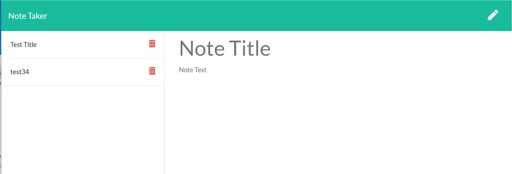

#Note Taker

Summary

Note taker is an app that allows users to retrieve pre-written notes, read notes, modify notes and write new notes for future retrieval. 

The deployed application may be seen at this link

https://normksb-note-taker.herokuapp.com/

Technologies used

- HTML/CSS/Javascript front end
- NODE JS/Express back end
- UUID node library for unique ID generation

Repo 

- Github Repo: https://github.com/Normksb/Note-Taker

